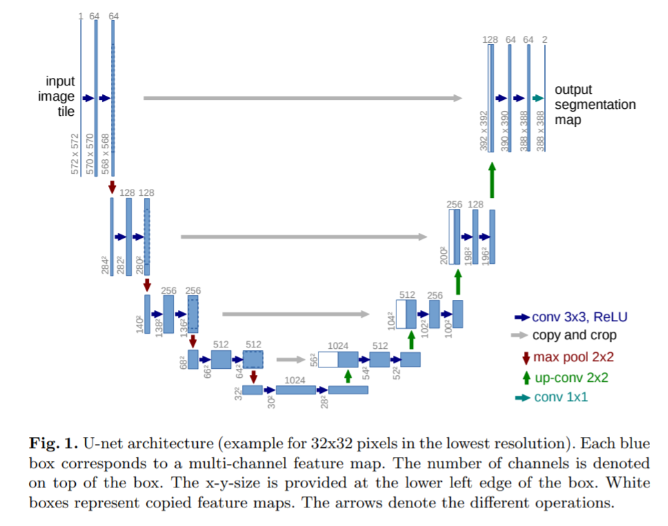

# Land cover classification using UNet

## Problem statement

<!-- TODO  -->

## Model architecture

Model architecture is similar to the one presented in original paper [U-Net: Convolutional Networks for Biomedical Image Segmentation](https://arxiv.org/pdf/1505.04597.pdf), mainly in case of depth and number of features at each level. Although there is some differences:

* 3 input channels (RGB) - 1 channel orignal,
* input images resized to 224 x 224 - that results in 28 x 28 feature maps in bottleneck (572 x 572 original),
* 24 classes prediction - 2 classes in original,
* no information loss due to small padding - no padding originally

## Things worth considering

* more channels:

* near infrared (NIR), 750–900 nm, used primarily for imaging vegetation
* thermal infrared, 10400-12500 nm, uses emitted instead of reflected radiation
* night images
